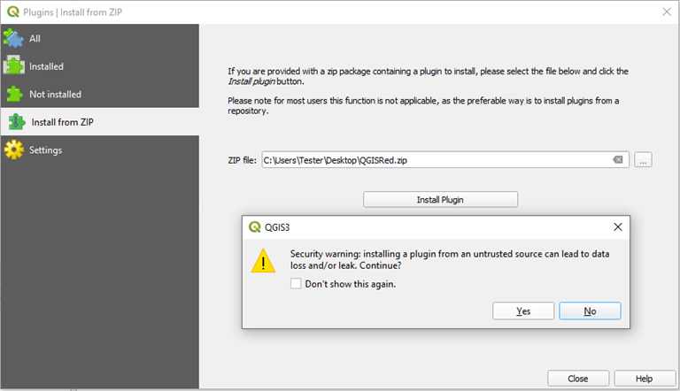

# Desde archivo local

Para instalar una actualización del plugin de forma local, previamente a los pasos que se comentan a continuación, es necesario desinstalarlo. Para ello, se puede desinstalar desde el propio gestor de complementos de QGis, o manualmente borrando el directorio correspondiente.

1.- Iniciar QGis v3.x

2.- Acceder al menú Complementos --> Administrar e instalar complementos…

.png>)

3.- Seleccionar la pestaña “Instalar a partir de ZIP”, seleccionar el fichero _**QGISRed.zip**_. A continuación, pulsar en “Instalar complemento” y si aparece el mensaje de aviso, pulsar en “Sí”.

4.- Cerrar la ventana al finalizar el proceso.

5.- Debe aparecer una nueva barra de botones y un nuevo elemento en el menú superior.

.png>)
